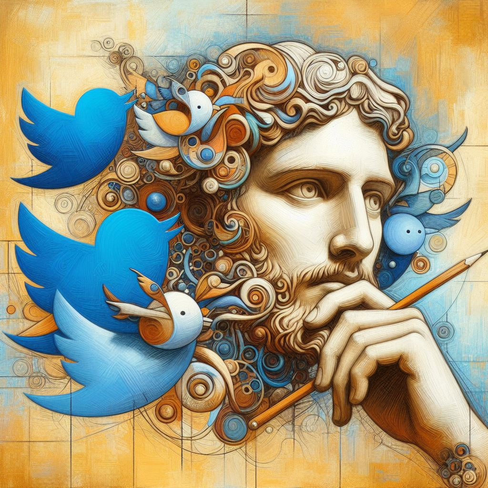

# TwitArt Project

  

## Overview
TwitArt is an innovative application built on the NestJS framework. It integrates various APIs to automate the creation and sharing of digital artwork based on trending Twitter hashtags.

## Key Features
- **Trend Analysis**: Utilizes RapidAPI to fetch trending hashtags from Twitter.
- **Content Generation**: Leverages OpenAI's GPT-4 to create creative prompts based on trends.
- **Image Creation**: Integrates DALL-E for generating unique images from the GPT-4 prompts.
- **Social Media Integration**: Automates the posting of generated artwork on Instagram using the Ayrshare API.

## Installation
1. Clone the repository.
2. Install dependencies: `npm install`.
3. Set up environment variables for API keys:
 - `OPENAI_API_KEY`
 - `RAPIDAPI_KEY`
 - `AYRSHARE_API_KEY`

## Usage
- Schedule the script to run every 6 hours using a cron job in `main.ts`.
- The app fetches trends, generates prompts, creates images, and posts to Instagram.

## Configuration
- Configure API keys in the `.env` file.
- Modify the cron job schedule in `main.ts` as needed.

## License
TwitArt is [MIT licensed](LICENSE).
